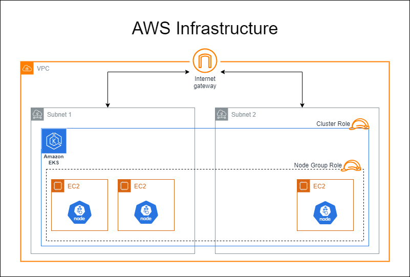

# Hurdle Archive Infrastructure

This repository contains the Infrastructure as Code (IaC) to deploy the Hurdle Archive application on an Amazon EKS cluster.

## Overview

The Hurdle Archive is an application that allows users to play and track thousands of Hurdle games. This repository leverages Terraform to automate the provisioning of the necessary infrastructure on AWS, specifically tailored for deployment on an EKS cluster.

## Architecture

The architecture diagram below illustrates the infrastructure setup for the Hurdle Archive application.

## Context

- **Application Source Code**: The Hurdle Archive application, including Docker packaging and Jenkins CI/CD pipeline, can be found [here](https://github.com/nlemberg/hurdle-archive).
- **GitOps Management**: This [GitOps repository](https://github.com/nlemberg/hurdle-archive-gitops) uses ArgoCD to declaratively manage the applications in the cluster and ensure continuous delivery.
